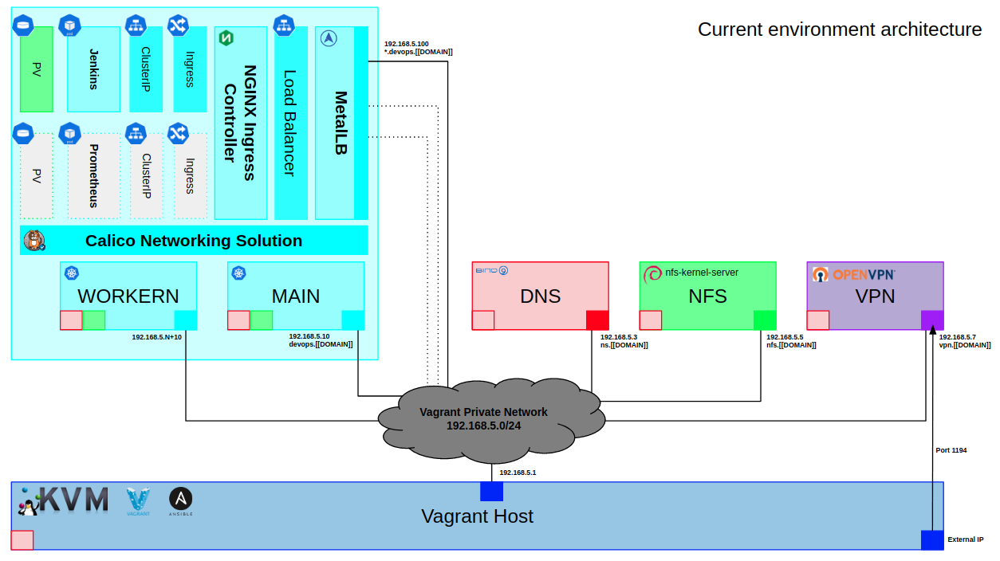

# Automatic deployment of a DevOps test environment

Automated deployment of a virtualized DevOps test environment on a k8s cluster provisioned by Vagrant on a Ubuntu Server 18.04.

Tools:

Infrastructure:				KVM, Vagrant and Ansible

Network services:			Bind9, NFS Kernel Server, OpenVPN

Container Orchestration:	Kubernetes (Docker Engine)

Cluster networking:		    Calico, Nginx Ingress Controller and MetalLB

DevSecOps:				    Jenkins, Prometheus, Grafana, HuskyCI…




# Installation

Clone the repository.

```bash
git clone https://github.com/mdnfiras/k8s-devops-env.git
```

Change directory.

```bash
cd k8s-devops-env
```

Install Vagrant on the host server along with all the required packages and plugins (KVM & LibVirt).


```bash
sudo chmod u=x requirements.sh
sudo ./requirements.sh
```

# Usage

Documentation ongoing !